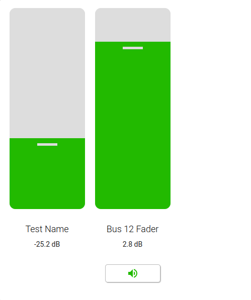
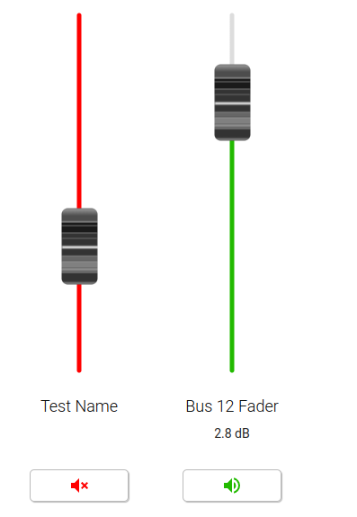

# mixer-card

A Lovelace Audio Mixer card for Home Assistant. Includes the ability to change volume and mute channels.

[![GitHub Release][releases-shield]][releases]
[![GitHub Activity][commits-shield]][commits]
[![License][license-shield]](LICENSE)

[![hacs][hacsbadge]][hacs]
[![GitHub Release][releases-shield]][releases]
[![License][license-shield]](LICENSE.md)


## Description

This card provides a series of vertical 'faders', each reflecting a 'channel' that allows you to control the audio volume of a number of audio sources.

Each fader has three elements
 - A Fader - giving the current set volume for the channel
 - A Display element - giving the current volume.
 - An Active/Mute button - Allow you to mute the channel

## Compatibility
A fader to be controlled is expected to be one of two things:
1. a `number` entity with values ranging from 0-1.
2. a `media_player`


## Options

Configuration is done by using YAML in the card config.


### Card Configuration

This configuration applies to all faders in the card

| Name                   | Description                                                                                                       | Default      |
|------------------------|-------------------------------------------------------------------------------------------------------------------|--------------|
| `faders`               | An array of faders - See *Fader Card Configuration*                                                               | **Required** |
| `borderRadius`         | The border radius for the individual faders                                                                       | `12px`       |
| `faderWidth`           | The width of each individual fader                                                                                | `150px`      |
| `faderHeight`          | The height of each individual fader                                                                               | `400px`      |
| `faderThumbColor`      | The color of the 'thumb' element of the fader (only valid for modern theme)                                       | `#ddd`       |
| `faderTrackColor`      | The color of the fader track                                                                                      | `#ddd`       |
| `faderActiveColor`     | The color of the active portion of the track when above 0                                                         | `#22ba00`    |
| `faderInactiveColor`   | The color of the track when the channel is muted/not-active                                                       | `#f00`       |
| `faderTheme`           | How should the fader's display. Options are `modern`/`physical`                                                   | `modern`     |
| `behringerMode`        | Enables BEHRINGER mode (see section: [BEHRINGER Mode](#behringer-mode))                                           | `false`      |
| `alwaysShowFaderValue` | If set, the fader value will be displayed even when the fader is not active.                                      | `false`*     |
| `updateWhileMoving`    | If set, the entity values will be updated while moving the fader. Off by default to prevent API request flooding. | `false`*     |
| `haCard`               | Should the card include a `<ha-card>` element? Boolean                                                            | `true`       |
| `title`                | Add a title to the card                                                                                           |              |
| `description`          | Add a description to the card                                                                                     |              |

\* Unless in [BEHRINGER Mode](#behringer-mode)


### Fader Card Configuration
This is the configuration for each individual fader

| Name               | Description                                                                                                                                                                                                                              | Default      |
|--------------------|------------------------------------------------------------------------------------------------------------------------------------------------------------------------------------------------------------------------------------------|--------------|
| `entity_id`        | The entity_id of the fader entity.  This is expected to be a `number` with values from 0-1.                                                                                                                                              | **Required** |
| `name`             | A friendly name for the channel. If not specified the name of the entity_id will be used                                                                                                                                                 | Optional     |
| `active_entity_id` | The entity_id of a `switch` entity that controls the active/mute state of the fader.  If not present (for a number element) then the active/mute button will not appear. If entity_id is a `media_player` this is handled automatically. | Optional     |
| `value_entity_id`  | The entity_id of a `sensor` entity that contains the current value of the fader (eg in dB).  If not present the value of the fader will be represented as a percentage (%) of the fader.                                                 | Optional     |
| `invert_active`    | If set to true, then the active state of the fader is inverted.                                                                                                                                                                          | Optional     |
| `thumb_color`      | Locally overrides the faderThumbColor                                                                                                                                                                                                    | Optional     |
| `track_color`      | Locally overrides the faderTrackColor                                                                                                                                                                                                    | Optional     |
| `active_color`     | Locally overrides the faderActiveColor                                                                                                                                                                                                   | Optional     |
| `inactive_color`   | Locally overrides the faderInactiveColor                                                                                                                                                                                                 | Optional     |

### Example Configuration
```yaml
    type: custom:custom-mixer-card
    faderWidth: 150px
    faderHeight: 400px
    borderRadius: 12px
    faderThumbColor: '#DDD'
    faderTrackColor: '#DDD'
    faderActiveColor: '#22ba00'
    faderInactiveColor: '#F00'
    faderTheme: modern
    faders:
      - entity_id: number.9f3fea35f92bc3ab474f8f76ad071ab9_bus_11_fader
        name: test name
        value_entity_id: sensor.9f3fea35f92bc3ab474f8f76ad071ab9_bus_11_fader_db
      - entity_id: number.9f3fea35f92bc3ab474f8f76ad071ab9_bus_12_fader
        active_entity_id: switch.9f3fea35f92bc3ab474f8f76ad071ab9_bus_12_on
        value_entity_id: sensor.9f3fea35f92bc3ab474f8f76ad071ab9_bus_12_fader_db
        invert_active: true
```

### Themes
This card can display the faders in two different options.
1. `modern` (Default)
This renders the faders as larger 'block' type faders similar to home assistant light faders.  This allows easier access for touch etc.



2. `physical`
This makes the faders look more like physical faders



### BEHRINGER Mode

When the card is in BEHRINGER mode, the fader value changes to a calculated dB value
based on the fader to dB conversion used in the BEHRINGER mixing desks and corresponding APIs and
software. Not relying on another value entity allows for the dB value to be updated instantly while
moving the fader.
BEHRINGER Mode also flips the defaults for the `alwaysShowFaderValue` and `updateWhileMoving` to true,
as the BEHRINGER APIs effortlessly can handle the amount of requests sent by the moving faders
and the always shown dB values come closer to the presentation of the faders in the companion
applications of the BEHRINGER desks.

## Installation

#### HACS installation:
Go to the hacs store and use the repo url https://github.com/wrodie/mixer-card and add this as a custom repository under settings.


# Thanks
I took ideas and some code from - https://github.com/DBuit/media_player-popup-card

[commits-shield]: https://img.shields.io/github/commit-activity/y/wrodie/mixer-card.svg?style=for-the-badge
[commits]: https://github.com/wrodie/mixer-card/commits/main
[hacs]: https://github.com/hacs/integration
[hacsbadge]: https://img.shields.io/badge/HACS-Custom-orange.svg?style=for-the-badge
[releases-shield]: https://img.shields.io/github/release/wrodie/mixer-card.svg?style=for-the-badge
[releases]: https://github.com/wrodie/mixer-card/releases
[license-shield]: https://img.shields.io/github/license/wrodie/mixer-card.svg?style=for-the-badge
